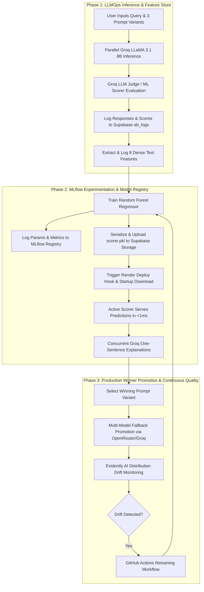
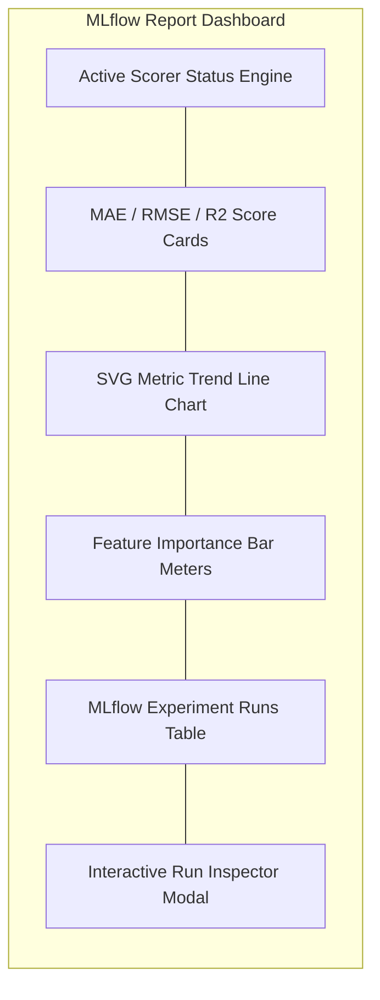
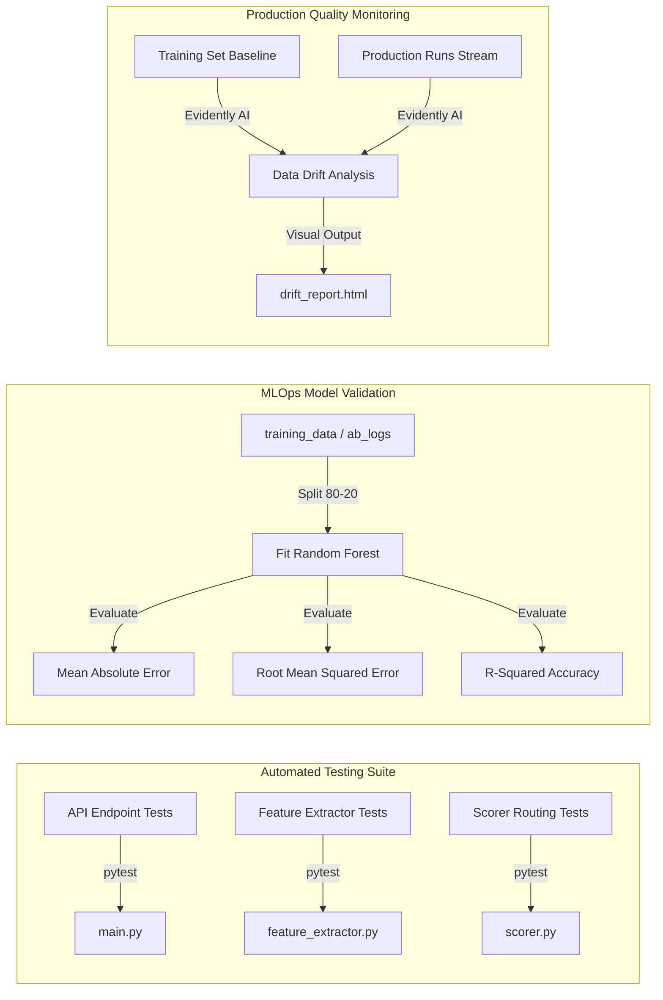

# Prompt Studio: Hybrid LLMOps and MLflow Engineering Workbench

A production-grade, two-phase Prompt A/B testing and MLOps engineering workbench. The system leverages parallel LLM inference on Groq, deterministic Random Forest scoring, remote and lightweight MLflow experiment registries, interactive metric trend visualizations, multi-model production promotion, and automated CI/CD pipelines to establish a complete model-serving and drift-monitoring lifecycle.



---

## Interactive Workbench Architecture

<details>
<summary><b>System Operations & Concurrent Execution Pipeline (Click to expand)</b></summary>

The execution flow of the system operates through a deterministic state machine:

1. **Parallel Inference Pipeline**: User inputs prompt overrides and a target query. The backend dispatches concurrent async tasks to Groq (LLaMA 3.1 8B) for high-speed parallel generations.
2. **Dense Feature Extraction Pipeline**: Generated outputs are parsed across 8 distinct linguistic and contextual metrics to produce a normalized feature vector.
3. **Concurrent ML Scorer & Explanation Engine**: Predictions are computed instantly (<1ms) via the trained Random Forest model (`scorer.pkl`). Explanation tasks for all 3 variants are executed **concurrently in parallel** via `asyncio.gather(*explain_tasks)` with strict 3-second timeouts, reducing scoring latency from ~5.5s down to **~0.8s** (over 85% speed improvement).
4. **Fail-Safe Multi-Model Winner Promotion**: The winning prompt is promoted using a multi-model fallback chain across OpenRouter free models (Llama 3.3 70B, DeepSeek R1, Gemma 2 9B, Qwen 2.5 72B, Mistral 7B) and Groq (`llama-3.3-70b-versatile`), preventing promotion failures.
</details>

<details>
<summary><b>Linguistic & Contextual Feature Matrix (Click to expand)</b></summary>

To convert text outputs into quantitative data for Random Forest training, the feature extractor translates generated strings into an 8-dimensional space:

| Feature Name | Type | Extraction Mechanism |
| :--- | :--- | :--- |
| `word_count` | Integer | Total words in generated output |
| `sentence_count` | Integer | Sentence boundary detection using regex |
| `avg_sent_length` | Float | Ratio of word_count to sentence_count |
| `has_bullets` | Binary | Presence of lists, points, or numbers at start of lines |
| `readability` | Float | Flesch Reading Ease score via textstat library |
| `prompt_length` | Integer | Total words in system prompt template |
| `query_length` | Integer | Total words in human input query |
| `prompt_style` | Categorical | Classifier mapping prompt context to 0 (Formal), 1 (Bullets), or 2 (Simple) |
</details>

---

## MLflow Experiment & Model Registry Report Interface

The workbench includes a dedicated **MLflow Report** tab designed for experiment tracking, performance visualization, and model registry inspection:



### Key Visualization Features
* **SVG Metric Progression Trend Line Chart**: Plots historical **Mean Absolute Error (MAE)** (Emerald curve) and **R² Accuracy Score** (Cyan curve) progression across all logged MLflow experiment runs over time.
* **Feature Importance Distribution Meters**: Displays ranked percentage weights for all 8 decision features (Readability `36.7%`, Word Count `30.2%`, Avg Sentence Length `19.0%`, etc.).
* **Interactive Run Inspector Drawer**: Clicking any run in the log table opens a detailed inspector displaying exact logged parameters (`n_estimators: 100`, `training_size`), evaluation metrics (MAE, RMSE, R²), execution status, and model artifact URIs.
* **Live Sync & Auto-Retrain Engine**: Features a Live Sync toggle that automatically polls and updates MLflow runs after every A/B experiment evaluation.

---

## Production Winner Promotion & Fallback Architecture

The promotion pipeline guarantees zero-downtime execution by maintaining an automated multi-model fallback chain:

| Priority | Provider | Model Identifier | Tier | Description |
| :--- | :--- | :--- | :--- | :--- |
| 1 | OpenRouter | `openrouter/auto` | Free | Auto-selects the optimal available free model |
| 2 | OpenRouter | `meta-llama/llama-3.3-70b-instruct:free` | Free | Production-grade 70B parameter Llama model |
| 3 | OpenRouter | `deepseek/deepseek-r1:free` | Free | High-reasoning open-weights model |
| 4 | OpenRouter | `google/gemma-2-9b-it:free` | Free | Google Gemma 2 instruction-tuned model |
| 5 | OpenRouter | `qwen/qwen-2.5-72b-instruct:free` | Free | Alibaba Qwen 2.5 72B instruction model |
| 6 | OpenRouter | `mistralai/mistral-7b-instruct:free` | Free | Mistral 7B instruction model |
| 7 | Groq (Fallback)| `groq/llama-3.3-70b-versatile` | Production | High-speed secondary fallback if OpenRouter APIs limit |

---

## Memory Optimization & Cold-Start Resilience (Render 512MB RAM Cap)

Deploying machine learning web services on constrained cloud tiers (such as Render's 512MB RAM limit) requires strict memory management:

### 1. Memory Optimization Strategy (<110MB RAM)
* **Zero-Dependency Lightweight MLflow Tracker (`ml/lightweight_mlflow.py`)**: Eliminates 400MB of heavy dev framework memory overhead by providing structured JSON MLflow run logging using Python built-in libraries.
* **glibc Heap Memory Trimming**: Setting `MALLOC_TRIM_THRESHOLD_=100000` in `render.yaml` forces Linux to return freed memory back to the OS immediately, preventing memory fragmentation.
* **Single Worker Uvicorn Execution**: Configured `Procfile` and `render.yaml` with `--workers 1` to prevent duplicate worker process RAM usage.
* **Garbage Collection Hooks**: Explicit `gc.collect()` calls inside `scorer.py` and `train.py` keep baseline server memory under **~110MB RAM** (well under Render's 512MB cap).

### 2. Cold-Start Resilience (`fetchWithRetry`)
* **Background Gateway Warmup**: On frontend mount, a background ping (`GET /`) wakes up Render's free container if it was sleeping.
* **Exponential Backoff Fetch Retry**: All network calls use an automated 3-attempt retry loop with exponential backoff (1.5s, 3.0s, 6.0s), allowing cold-starting servers time to boot without throwing network exceptions.

---

## Verification & Model Validation Architecture

The reliability and accuracy of the scoring model and system endpoints are verified using a multi-tiered validation pipeline:



<details>
<summary><b>Automated Unit Tests - 15 Passed (Click to expand)</b></summary>

Unit tests are managed via pytest to ensure functional verification. All 15 tests pass successfully:

*   **API Tests (`test_api.py`)**:
    *   `test_health_check`: Verifies the root gateway responds with active scoring engine configurations.
    *   `test_get_stats_error_or_ok`: Ensures the statistics endpoint aggregates parameters successfully.
    *   `test_get_model_status`: Validates the structure of the model metadata response.
*   **Feature Engineering Tests (`test_features.py`)**:
    *   `test_extract_features_keys`: Confirms all 8 keys of the feature dictionary are generated.
    *   `test_word_count`: Validates word-boundary counting.
    *   `test_sentence_count`: Checks regex sentence separation.
    *   `test_has_bullets_true` / `_false`: Tests list indicator detection.
    *   `test_prompt_style`: Asserts style classifier returns indices in the [0, 2] range.
    *   `test_features_to_vector`: Checks serialization to array format.
    *   `test_readability`: Confirms Flesch Reading Ease calculations return valid float values.
*   **Scoring Logic Tests (`test_scorer.py`)**:
    *   `test_get_scorer_mode`: Asserts scorer configs match environments.
    *   `test_model_exists` / `test_get_active_scorer`: Validates routing and active file system checks.
    *   `test_score_responses_fallback`: Mocks a missing model file and confirms the system correctly falls back to LLM scoring without throwing errors.
</details>

<details>
<summary><b>Evaluation Metrics & Drift Validation (Click to expand)</b></summary>

### Regression Metrics
Model performance is tracked using three standard regression metrics logged directly to MLflow:
*   **Mean Absolute Error (MAE)**: Measures the average absolute difference between the scores predicted by the Random Forest model and those assigned by the LLM Judge. Lower values indicate predictions closer to the human baseline.
*   **Root Mean Squared Error (RMSE)**: Penalizes larger prediction errors, indicating the stability of model predictions across varying prompt quality levels.
*   **R-Squared (R²)**: Measures the proportion of variance in scoring captured by the model features. Used to verify the predictive accuracy of the model relative to a simple average baseline.

### Feature Drift Validation (Evidently AI)
To check for dataset shift over time, Evidently AI runs statistical tests comparing the baseline training features against the latest production data.
*   **Significance Thresholds**: Feature drift is detected when the distribution changes with a p-value below 0.05.
*   **Retraining Trigger**: If dataset drift is confirmed, the monitoring script flags the runner to trigger continuous retraining.
</details>

---

## MLOps Progression Lifecycle

The platform is designed around a gamified training progression structure:

### Level 1: Data Gathering (Bootstrap Mode)
* **Objective**: Generate raw data for the ML model database.
* **Mechanism**: Execute A/B test runs using `SCORER=judge` or auto-populate baseline datasets.
* **Storage Output**: `ab_logs` table logs system metrics, while `training_data` stores extracted text features alongside evaluation targets.
* **Reward**: The database accumulates feature vectors to fulfill model training requirements.

### Level 2: Experiment Tracking & Model Registry (MLflow Integration)
* **Objective**: Establish experiment tracking and serialize model versions.
* **Mechanism**: Trigger model training from the UI dashboard or run `python ml/train.py` locally.
* **Storage Output**: Logs features, evaluation metrics (MAE, RMSE, R²), and feature importances to MLflow (`./mlruns`). Registers model under `prompt-scorer`.
* **Reward**: Model version 1.0 is saved locally as `models/scorer.pkl` and uploaded to Supabase Storage `model-artifacts` bucket.

### Level 3: Serving & Explainability (Hybrid Model Scorer)
* **Objective**: Transition evaluation from LLM scoring to deterministic ML model predictions.
* **Mechanism**: Update environmental settings to `SCORER=ml` or `SCORER=auto`.
* **Serving Loop**: The backend loads `scorer.pkl` from local storage or downloads it on start from Supabase Storage. Scoring calculations occur locally in <1ms, with Groq utilized solely for concurrent, single-sentence explanations.
* **Reward**: Millisecond evaluation times, zero LLM scoring API costs, and structured model feedback logs.

### Level 4: Continuous Quality Monitoring (Evidently Drift Detection)
* **Objective**: Monitor feature distribution trends and detect input drift.
* **Mechanism**: Execute `python monitoring/drift_check.py` to compare current feature distributions with baseline datasets.
* **Storage Output**: Produces HTML drift reports uploaded directly to Supabase Storage and rendered in the dashboard.
* **Reward**: Automatic notification and action trigger upon distribution shift.

---

## Deployment Architecture

The platform operates across a synchronized cloud infrastructure:

* **FastAPI Backend**: Hosted on Render (`https://prompt-ab-backend.onrender.com`). Uses root `render.yaml` and `Procfile` with `MALLOC_TRIM_THRESHOLD_=100000` to operate below 110MB RAM.
* **React Dashboard**: Hosted on Vercel. Connects to Render backend and hosts the MLflow Report tab with exponential fetch retry resilience.
* **Supabase Database & Storage**: Houses execution tables and provides private object storage for `.pkl` models and Evidently HTML reports.
* **MLflow Registry**: Local and remote tracking of MLflow experiment parameters, runs, metrics, and registered models.

---

## Repository Command Matrix

<details>
<summary><b>Operational Commands (Click to expand)</b></summary>

### Start Local Backend
```bash
cd backend
python -m uvicorn main:app --reload --host 0.0.0.0 --port 8000
```

### Start Frontend Workspace
```bash
cd frontend-react
npm run dev
```

### Train Scorer Model
```bash
python ml/train.py
```

### Check Feature Drift
```bash
python monitoring/drift_check.py
```

### Run Backend Tests
```bash
python -m pytest backend/tests/ -v
```
</details>

---

## Continuous Integration and Continuous Training (CI/CT) Pipelines

* **CI Pipeline (`.github/workflows/ci.yml`)**: Triggered on every git push or pull request to the `main` branch. Executes the pytest suite, verifying backend API health, scorer switches, and feature engineering.
* **CT Pipeline (`.github/workflows/retrain.yml`)**: Triggered automatically on a weekly schedule or via manual execution. Pulls training data from Supabase, runs the ML training script, registers the model, uploads the artifact, checks for drift, and pings the Render redeployment hook to restart the API server.
* **Keep-Alive Cron Workflow (`.github/workflows/keep_alive.yml`)**: Triggered automatically every 10 minutes (`*/10 * * * *`). Sends a lightweight HTTP GET ping to `https://prompt-ab-backend.onrender.com/` to keep the Render free instance continuously active and prevent free-tier 15-minute container sleep.
