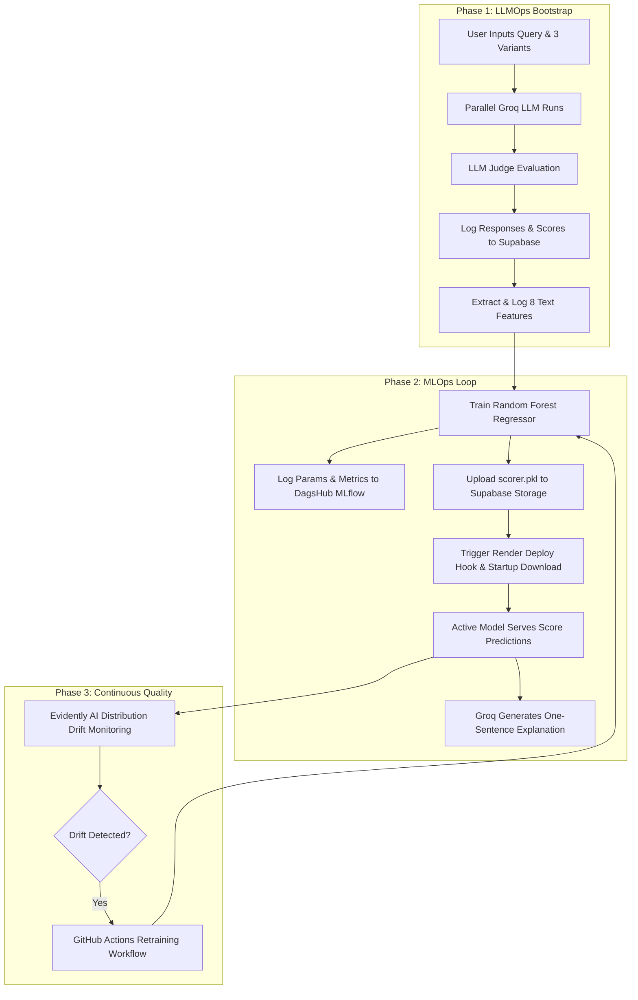

# Prompt Studio: Hybrid LLMOps and MLOps Pipeline Workbench

A production-grade, two-phase Prompt A/B testing and MLOps engineering workbench. The system leverages parallel LLM inference, deterministic Random Forest scoring, remote MLflow experiment registries, and automated GitHub Actions pipelines to establish a complete model-serving and drift-monitoring lifecycle.



---

## Interactive Workbench Architecture

<details>
<summary><b>System Operations Pipeline (Click to expand)</b></summary>

The execution flow of the system operates through a deterministic pipeline state machine:

1. **Inference Pipeline**: User provides system prompt overrides and a target query. The engine dispatches concurrent threads to Groq (LLaMA 3.1 8B) for high-speed parallel generations.
2. **Feature Extraction Pipeline**: The system parses responses, computing 8 distinct linguistic and contextual metrics to produce a dense feature vector.
3. **Scoring Engine**: Depending on configuration and registry status, predictions are routed to either the LLM Judge or the Random Forest model.
4. **Promotion Pipeline**: The highest-rated response is selected as the winner, promoted, and sent to Llama 3.3 70B via OpenRouter for production inference.
</details>

<details>
<summary><b>Linguistic & Contextual Feature Matrix (Click to expand)</b></summary>

To convert text outputs into quantitative data for Random Forest training, the feature extractor translates generated strings into an 8-dimensional space:

| Feature Name | Type | Extraction Mechanism |
| :--- | :--- | :--- |
| `word_count` | Integer | Total words in generated output |
| `sentence_count` | Integer | Sentence boundary detection using regex |
| `avg_sent_length` | Float | Ratio of word_count to sentence_count |
| `has_bullets` | Binary | Presence of lists, points, or numbers at start of lines |
| `readability` | Float | Flesch Reading Ease score via textstat library |
| `prompt_length` | Integer | Total words in system prompt template |
| `query_length` | Integer | Total words in human input query |
| `prompt_style` | Categorical | Classifier mapping prompt context to 0 (Formal), 1 (Bullets), or 2 (Simple) |
</details>

---

## MLOps Progression Lifecycle

The platform is designed around a gamified training progression structure. Move through the levels to unlock production features:

### Level 1: Data Gathering (Bootstrap Mode)
* **Objective**: Generate raw data for the ML model database.
* **Mechanism**: Run 50 to 240 parallel runs with the `SCORER=judge` configuration.
* **Storage Output**: `ab_logs` table logs system metrics, while `training_data` stores extracted text features alongside evaluation targets.
* **Reward**: The database accumulates enough rows to fulfill model training requirements.

### Level 2: Experiment Tracking & Model Registry (MLflow Integration)
* **Objective**: Establish experiment tracking and serialize the first model version.
* **Mechanism**: Trigger model training from the UI dashboard or run `python ml/train.py` locally.
* **Storage Output**: Logs features, evaluation metrics (MAE, RMSE, R²), and feature importances to MLflow. The system automatically registers the model under `prompt-scorer`.
* **Reward**: Model version 1.0 is uploaded to the remote Supabase Storage `model-artifacts` bucket.

### Level 3: Serving & Explanability (Hybrid Model Scorer)
* **Objective**: Transition evaluation from LLM scoring to deterministic ML model predictions.
* **Mechanism**: Update environmental settings to `SCORER=ml` or `SCORER=auto`.
* **Serving Loop**: The backend loads `scorer.pkl` from local storage or downloads it on start from Supabase Storage. Scoring calculations occur locally in milliseconds, with Groq utilized solely for a brief, single-sentence explanation.
* **Reward**: Millisecond evaluation times, zero LLM scoring API costs, and structured model feedback logs.

### Level 4: Continuous Quality Monitoring (Evidently Drift Detection)
* **Objective**: Monitor feature distribution trends and detect input drift.
* **Mechanism**: Execute `python monitoring/drift_check.py` to compare current feature distributions with baseline datasets.
* **Storage Output**: Produces drift reports uploaded directly to Supabase Storage and rendered in the dashboard iframe.
* **Reward**: Automatic notification and action trigger upon distribution shift.

---

## Deployment Architecture

The platform operates across a synchronized cloud infrastructure:

* **FastAPI Backend**: Hosted on Render. The server downloads the active `scorer.pkl` model artifact from Supabase Storage on startup.
* **React Dashboard**: Hosted on Vercel. Connects to Render backend and hosts the MLOps Control Center tab.
* **Supabase Database & Storage**: Houses execution tables and provides private object storage for `.pkl` models and Evidently HTML reports.
* **DagsHub Registry**: Remote hosting of MLflow experiment parameters, runs, metrics, and models.

---

## Repository Command Matrix

<details>
<summary><b>Operational Commands (Click to expand)</b></summary>

### Start Local Backend
```bash
cd backend
python -m uvicorn main:app --reload --host 127.0.0.1 --port 8000
```

### Start Frontend Workspace
```bash
cd frontend-react
npm run dev
```

### Train Scorer Model
```bash
python ml/train.py
```

### Check Feature Drift
```bash
python monitoring/drift_check.py
```

### Run Backend Tests
```bash
python -m pytest backend/tests/ -v
```
</details>

---

## Continuous Integration and Continuous Training (CI/CT) Pipelines

* **CI Pipeline (`.github/workflows/ci.yml`)**: Triggered on every git push or pull request to the `main` branch. It executes the pytest suite, verifying backend API health, scorer switches, and feature engineering.
* **CT Pipeline (`.github/workflows/retrain.yml`)**: Triggered automatically on a weekly schedule or via manual execution. It pulls training data from Supabase, runs the ML training script, registers the model, uploads the artifact, checks for drift, and pings the Render redeployment hook to restart the API server.
